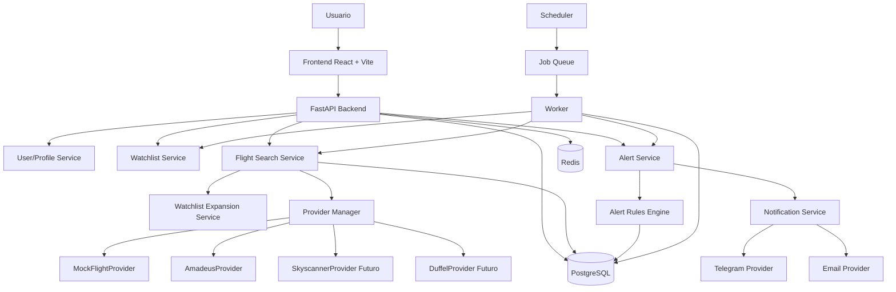
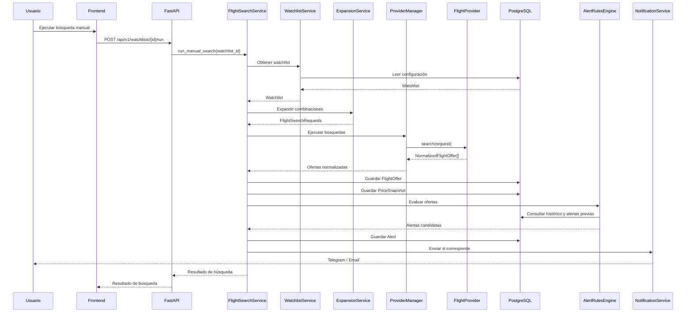
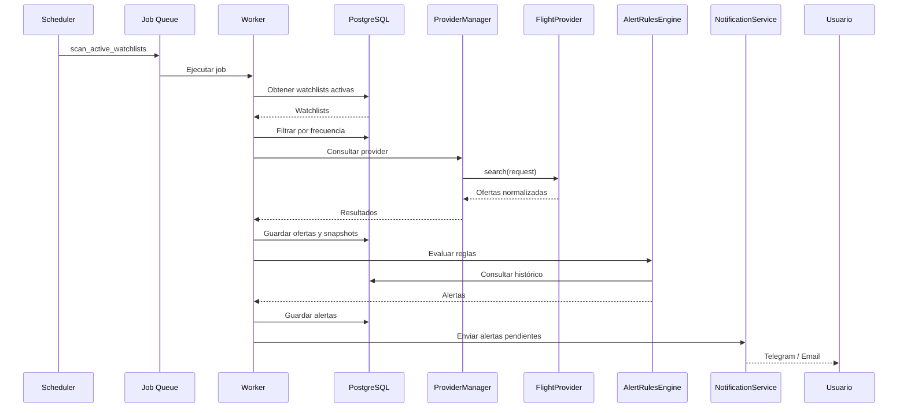
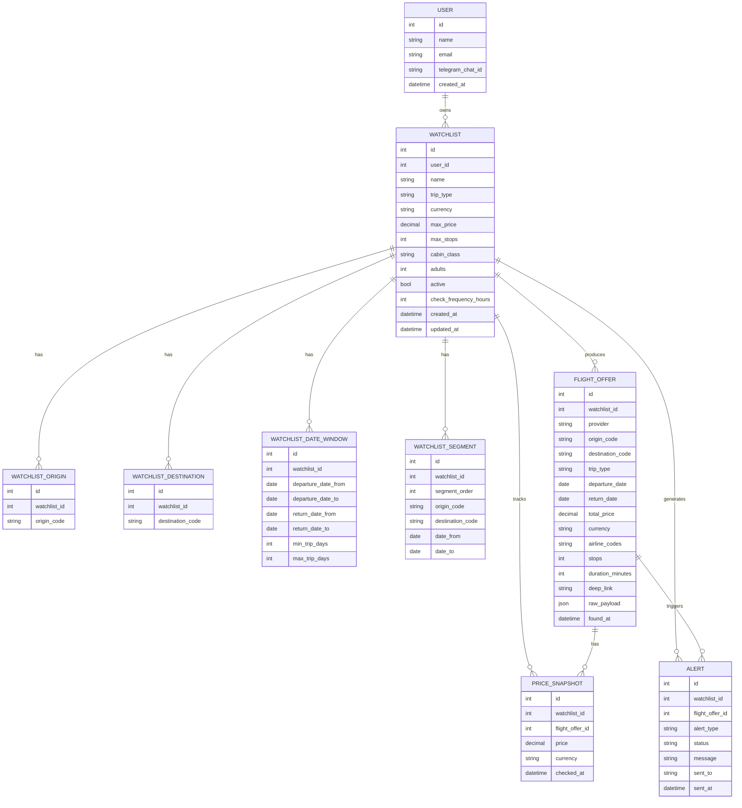
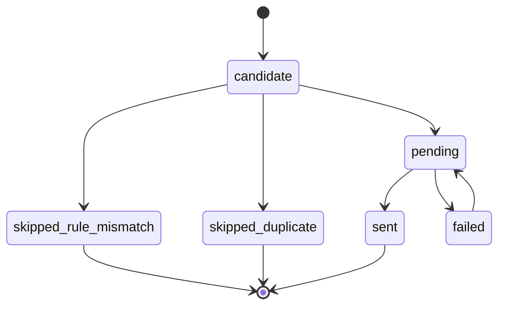

# FareRadar — Architecture

## Objetivo de arquitectura

FareRadar debe ser una aplicación web extensible para monitorear vuelos y generar alertas inteligentes.

La arquitectura debe permitir:

- Agregar nuevos proveedores de vuelos sin reescribir la lógica principal.
- Ejecutar búsquedas manuales y automáticas.
- Guardar histórico de precios.
- Evaluar reglas de alerta.
- Enviar notificaciones por distintos canales.
- Escalar de un MVP simple a una plataforma más completa.

---

## Principios de diseño

1. Separar lógica de negocio de infraestructura.
2. No acoplar el dominio a APIs externas.
3. Usar providers intercambiables.
4. Guardar respuestas normalizadas y payload crudo.
5. Tener tests desde fases tempranas.
6. Usar configuración por variables de entorno.
7. Evitar scraping en el MVP.
8. Diseñar para múltiples orígenes y destinos.
9. Soportar one-way, round-trip y multi-city desde el modelo.
10. Evitar alertas duplicadas.

---

## Diagrama de componentes



### Explicación

El backend expone la API REST. Las búsquedas pueden ejecutarse manualmente desde el frontend o automáticamente desde workers. Los providers externos están aislados detrás de `ProviderManager`.

---

## Flujo de búsqueda manual



El router solo valida la entrada HTTP y delega el caso de uso. La orquestación queda en `FlightSearchService`.

---

## Deploy en Railway

Railway es el objetivo inicial de despliegue.

Servicios esperados:

```txt
fare-radar-api
fare-radar-worker
fare-radar-scheduler
fare-radar-frontend
PostgreSQL
Redis
```

Comandos esperados:

```txt
API:       uvicorn app.main:app --host 0.0.0.0 --port $PORT
Worker:    celery -A app.workers.celery_app worker --loglevel=info
Scheduler: celery -A app.workers.celery_app beat --loglevel=info
```

Notas:

- La API debe respetar `$PORT`.
- PostgreSQL y Redis deben venir de variables de entorno de Railway.
- Las migraciones de Alembic deben tener un comando documentado y ejecutarse de forma controlada.
- `docker-compose.yml` se mantiene solo para desarrollo local.

---

## Flujo de búsqueda automática



---

## Diagrama entidad-relación conceptual



---

## Estados de una alerta



### Estados

- `candidate`: oferta que podría generar alerta.
- `pending`: alerta aprobada por reglas y pendiente de envío.
- `sent`: alerta enviada correctamente.
- `failed`: falló el envío.
- `skipped_duplicate`: ignorada por cooldown o duplicado.
- `skipped_rule_mismatch`: ignorada porque no cumple reglas.

---

## Capas del backend

```txt
app/
├── api/              # Routers FastAPI
├── core/             # Configuración, settings, seguridad
├── db/               # Session, base, conexión
├── models/           # Modelos SQLAlchemy
├── schemas/          # Schemas Pydantic
├── repositories/     # Acceso a datos
├── services/         # Lógica de negocio
├── providers/        # Providers de vuelos
├── notifications/    # Notificaciones
├── workers/          # Jobs y scheduler
└── tests/            # Tests
```

---

## Provider abstraction

Todos los proveedores deben implementar una interfaz común:

```txt
FlightSearchProvider
```

Método esperado:

```txt
search(request: FlightSearchRequest) -> list[NormalizedFlightOffer]
```

---

## Providers

### MockFlightProvider

Primer provider obligatorio.

Sirve para:

- Desarrollar sin APIs externas.
- Testear reglas.
- Generar datos falsos realistas.
- Construir frontend sin depender de Amadeus.

### AmadeusProvider

Primer provider real.

Debe implementarse después de tener funcionando:

- Watchlists.
- Mock provider.
- Search engine.
- Motor de alertas.
- Snapshots.
- Tests.

### Otros providers futuros

- Skyscanner.
- Duffel.
- Kiwi/Tequila.
- APIs de agencias.
- Feeds internos.

---

## Servicios principales

### WatchlistService

Responsabilidades:

- Crear watchlists.
- Editar watchlists.
- Activar/desactivar.
- Validar configuración.
- Obtener watchlists activas.

### WatchlistExpansionService

Responsabilidades:

- Convertir una watchlist en múltiples requests de búsqueda.
- Expandir orígenes contra destinos.
- Expandir fechas.
- Expandir duraciones de viaje.
- Crear requests multi-city.

### FlightSearchService

Responsabilidades:

- Ejecutar una búsqueda.
- Llamar al provider.
- Normalizar ofertas.
- Guardar resultados.
- Registrar logs.

### AlertRulesEngine

Responsabilidades:

- Evaluar si una oferta merece alerta.
- Comparar contra precio máximo.
- Comparar contra promedio histórico.
- Detectar mínimo histórico.
- Evitar duplicados.
- Aplicar cooldown.

### NotificationService

Responsabilidades:

- Formatear mensajes.
- Enviar Telegram.
- Enviar email.
- Registrar errores.

---

## Decisiones técnicas

### FastAPI en lugar de Flask

FastAPI es mejor para este proyecto porque:

- Tiene validación fuerte con Pydantic.
- Genera documentación automática.
- Encaja bien con una API REST separada del frontend.
- Tiene mejor experiencia para schemas y typing.

### PostgreSQL

Se elige PostgreSQL porque:

- Es robusto.
- Maneja relaciones complejas.
- Permite JSON para raw payloads.
- Es ideal para histórico de precios.

### Redis + workers

Se necesitan workers porque:

- Las búsquedas pueden tardar.
- Las APIs externas tienen latencia.
- El scheduler debe correr en segundo plano.
- Las alertas no deben bloquear requests HTTP.

### ProviderManager

Se usa para evitar acoplamiento.

El sistema no debe saber si la búsqueda viene de Mock, Amadeus, Skyscanner o Duffel.

---

## Riesgos de arquitectura

### Explosión de combinaciones

Múltiples orígenes, destinos, fechas y duraciones pueden generar demasiadas consultas.

Mitigación:

- Limitar máximo de combinaciones por ejecución.
- Agregar validaciones.
- Dividir trabajos.
- Priorizar fechas.
- Usar scheduler.

### Costo de APIs

Las APIs reales pueden tener límites o costos.

Mitigación:

- Mock provider.
- Rate limit.
- Caché.
- Control de frecuencia.

### Datos inconsistentes

Cada provider devuelve campos distintos.

Mitigación:

- NormalizedFlightOffer.
- raw_payload.
- campos opcionales.
- tests por provider.

---

## Regla de oro

Nunca llamar APIs externas directamente desde routers.

Correcto:

```txt
Router
→ Service
→ ProviderManager
→ Provider
```

Incorrecto:

```txt
Router
→ Amadeus API
```
